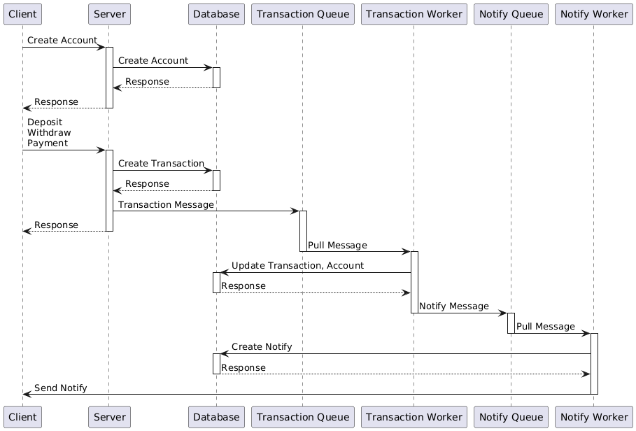

# FintechEventProcessingSystem

Go-based backend for fintech flows (**user signup**, **deposit**, **withdraw**, **payment**) using:
- **Gin**
- **gRPC** 
- **PostgreSQL**
- **RabbitMQ**
- **golang-migrate**
- **sqlc**
- **pgx**

## Prerequisites

Before running the project, ensure the following tools are installed:

- **[Docker](https://docs.docker.com/get-docker/)** – to run PostgreSQL and RabbitMQ.
- **[Docker Compose](https://docs.docker.com/compose/)** – to start all containers with one command.
- **[Make](https://www.gnu.org/software/make/)** – to run project build and setup commands.
- **[protoc](https://grpc.io/docs/protoc-installation/)** - protocol buffers compiler.
- **[golang-migrate](https://github.com/golang-migrate/migrate/tree/master/cmd/migrate)** – database migrations.
- **[sqlc](https://sqlc.dev/)** – generates type-safe Go code from SQL queries.

## Sequence Diagram

